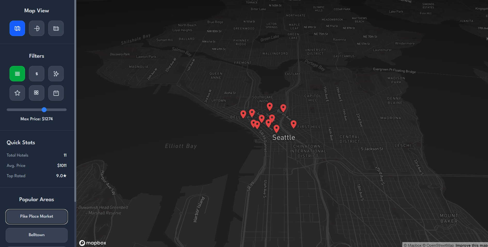

# 🏨 Hotel Discovery Platform

A modern, interactive hotel discovery platform built with React, TypeScript, Vite, and Mapbox. Explore hotels on a 3D map, filter by price, rating, amenities, and area, and enjoy a beautiful dark mode UI.

---

## ✨ Features

- 🗺️ **Interactive Map**: 3D Mapbox map with dark mode, terrain, and building extrusion
- 🏨 **Hotel Markers**: Clickable markers with detailed popups and all amenities
- 🔍 **Filters**: Filter hotels by price, rating, amenities, and location
- 📊 **Quick Stats**: Real-time stats for total hotels, average price, and top rating
- 📍 **Popular Areas**: Quick navigation to popular Seattle neighborhoods
- 🌙 **Dark Mode**: Consistent, elegant dark theme
- ⚡ **Fast & Responsive**: Powered by Vite and optimized for performance

---

## 📸 Screenshots




---

## 🚀 Getting Started

### 1. **Clone the repository**

```bash
git clone https://github.com/godking123/hotel-discovery-platform.git
cd hotel-discovery-platform
```

### 2. **Install dependencies**

```bash
npm install
```

### 3. **Mapbox Token Setup**

- Create a `.env` file:

```ts
export const VITE_MAPBOX_TOKEN = "your_mapbox_access_token_here";
```


### 4. **Run the app**

```bash
npm run dev
```

The app will be available at [http://localhost:5173](http://localhost:5173)

---

## 🗂️ Folder Structure

```
hotel-discovery-platform/
├── public/           # Static assets
├── src/
│   ├── assets/       # Images and icons
│   ├── components/   # React components (Map, Sidebar, etc.)
│   ├── config/       # Mapbox token (not tracked by git)
│   ├── data/         # Hotel data (JSON, helpers)
│   ├── index.css     # Tailwind & custom styles
│   ├── App.tsx       # Main app
│   └── main.tsx      # Entry point
├── .gitignore
├── package.json
├── README.md
└── ...
```

---

## 🛠️ Tech Stack

- [React](https://react.dev/)
- [TypeScript](https://www.typescriptlang.org/)
- [Vite](https://vitejs.dev/)
- [Mapbox GL JS](https://docs.mapbox.com/mapbox-gl-js/)
- [Framer Motion](https://www.framer.com/motion/)
- [Tailwind CSS](https://tailwindcss.com/)

---

## 🤝 Contributing

Contributions are welcome! Please open an issue or submit a pull request.

---

## 📝 License

MIT License. See [LICENSE](LICENSE) for details.
